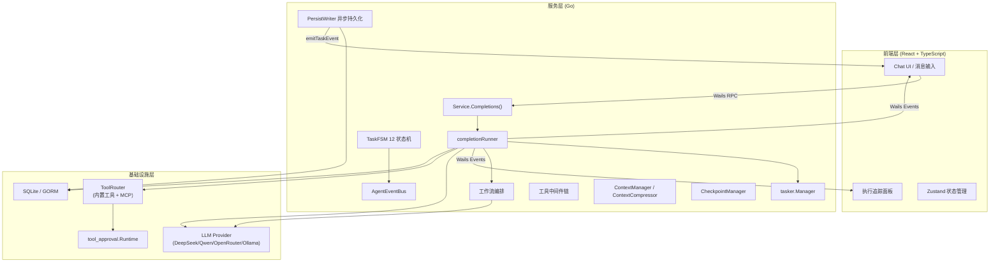
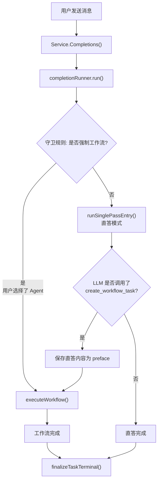
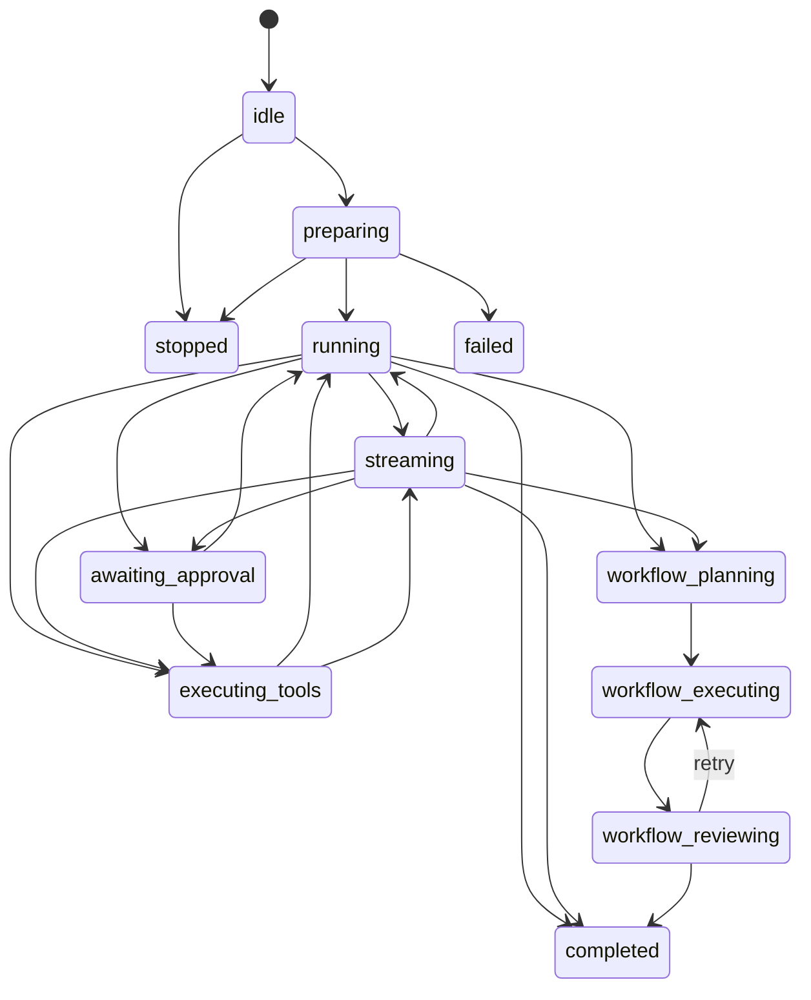
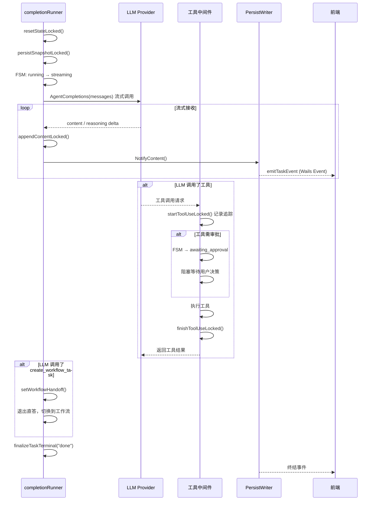
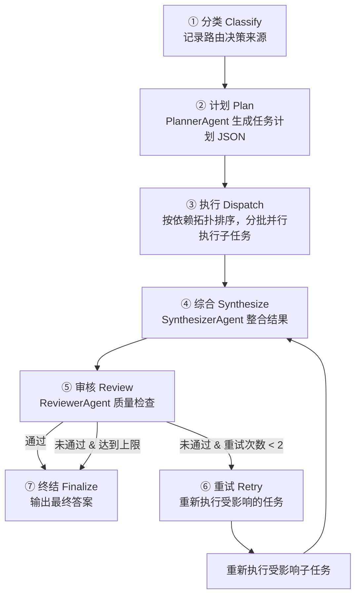
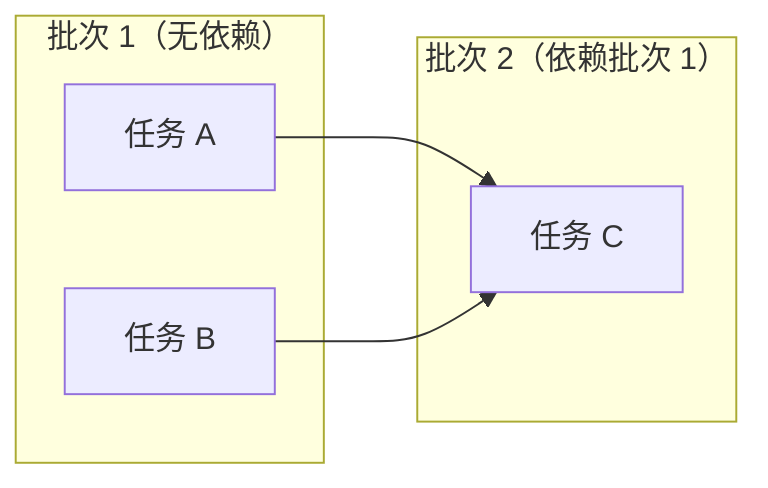
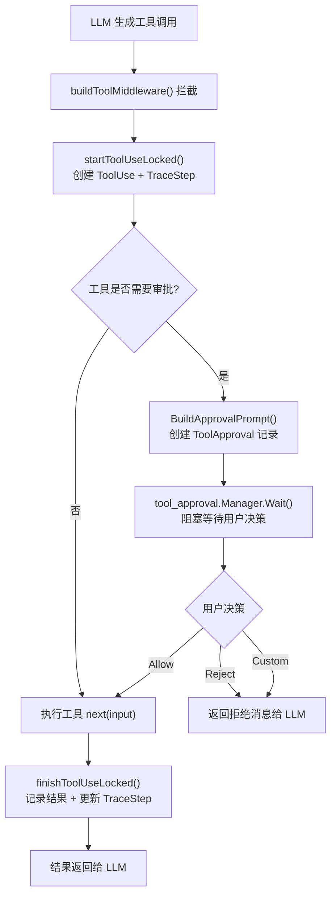
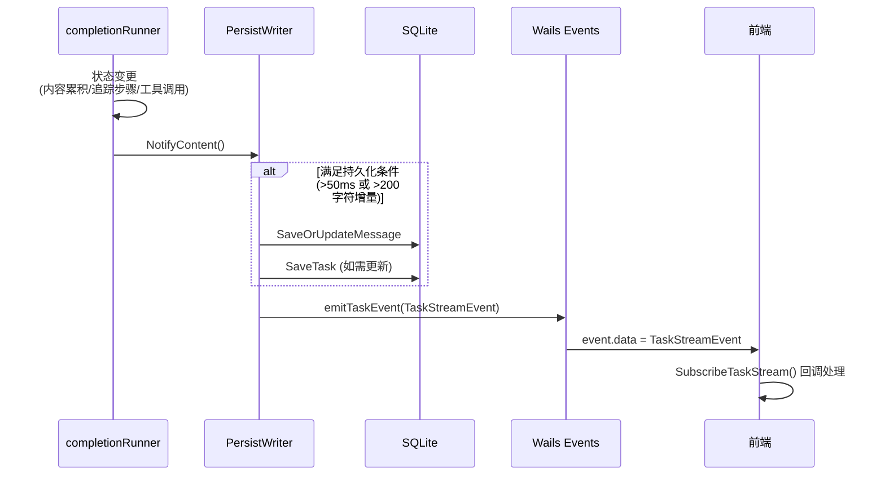

# Lemon Tea Desktop — Agent 流程文档

## 1. 项目概述

Lemon Tea Desktop 是一个跨平台 AI 桌面客户端，支持多轮对话、工具调用、MCP 工具集成、工作流编排、审批机制和任务恢复。

**技术栈：**

| 层级 | 技术 |
|------|------|
| 后端 | Go 1.25 + CloudWeGo Eino (Agent 编排框架) |
| 前端 | React 19 + TypeScript + Vite + Ant Design |
| 桌面框架 | Wails v3 |
| 存储 | SQLite + GORM |
| LLM 适配 | DeepSeek、通义千问、OpenRouter、Ollama、OpenAI 兼容接口 |

---

## 2. 架构概览

### 2.1 三层架构



### 2.2 双路径决策

系统支持两种执行路径：**直答**（Direct Answer）和**工作流**（Workflow）。



**路由决策规则：**
- 守卫规则触发（`shouldForceWorkflow`）→ 强制进入工作流
- 否则先尝试直答，LLM 可在直答过程中主动调用 `create_workflow_task` 工具切换到工作流

---

## 3. 核心组件

### 3.1 Service.Completions

> `backend/service/chat.go:114`

入口函数，负责：

1. **参数校验** — 验证 `UserMessageExtra` 存在
2. **生成标识符** — `chatUuid`、`taskUuid`、`assistantMessageUuid`、`eventKey`
3. **获取模型配置** — 通过 `storage.GetProviderModel()` 查找模型
4. **解析工具集** — `resolveSelectedTools()` 加载内置工具 + MCP 工具，返回 toolMetaByID 映射
5. **加载自定义 Agent** — 读取自定义 Agent 及其工具/技能/提示词
6. **准备消息** — 合并历史消息 + 当前用户消息，转换为 `schema.Message` 格式
7. **创建 DB 记录** — 用户消息、助手消息（空占位）、任务记录
8. **创建 Runner** — `newCompletionRunner()` 封装所有运行时状态
9. **构建工具中间件** — `buildToolMiddleware()` 用于拦截工具调用
10. **创建 LLM Provider** — `llm_provider.NewLlmProvider()` 绑定模型 + 工具 + 中间件 + 子 Agent
11. **启动异步任务** — `tasker.Manager.StartTask(runner.run)`

### 3.2 completionRunner

> `backend/service/chat_completion_runner.go:37`

封装一次 Completions 调用的全部运行时状态，是系统的核心执行引擎。

```go
type completionRunner struct {
    // 外部依赖（创建后只读）
    svc              *Service
    provider         *llm_provider.Provider
    localizedPrompts prompts.PromptSet
    agentTools       []tool.BaseTool
    schemaMessages   []schema.Message

    // 标识符（不可变）
    chatUuid, assistantMessageUuid, taskUuid, eventKey string

    // 受 mu 保护的可变状态
    mu                sync.Mutex
    assistantMessage  data_models.Message     // 持续更新的助手消息
    task              data_models.Task        // 当前任务状态
    pendingTraceDelta []data_models.TraceStep // 待发送的追踪步骤增量

    // 工作流切换状态（受 handoffMu 保护）
    handoffMu               sync.Mutex
    workflowHandoffDecision *workflowHandoff

    // 原子状态
    userStopped          atomic.Bool // 用户是否主动停止
    terminalEventEmitted atomic.Bool // 终结事件是否已发射

    // 新增组件
    fsm            *TaskFSM            // 12 状态机
    eventBus       *AgentEventBus      // 内部事件总线
    ctxManager     *ContextManager     // 上下文管理
    checkpoint     *CheckpointManager  // 检查点管理
    persistWriter  *PersistWriter      // 异步持久化
    toolMiddleware compose.ToolMiddleware // 工具中间件
}
```

### 3.3 tasker.Manager

> `backend/pkg/tasker/manager.go`

全局单例，管理异步任务的生命周期，通过信号量控制最大并发数（默认 5）：

- `StartTask(runtime, fn)` — 启动 goroutine 执行任务（阻塞在信号量上）
- `TryStartTask(runtime, fn)` — 非阻塞尝试，达到上限立即返回错误
- `StopTask(taskUUID)` — 通过 `stopCh` 通道发送停止信号
- `CancelAndReplace(chatUUID, newTask, fn)` — 取消同一聊天下的旧任务并启动新任务
- `GetTaskRuntime(taskUUID)` — 查询任务运行状态
- `ListRunningTasks()` — 获取所有活跃任务
- `SetMaxWorkers(max)` — 动态调整最大并发数

### 3.4 llm_provider.Provider

> `backend/pkg/llm_provider/provider.go`

LLM 供应商抽象层，封装：

- `chatModel` — 基础聊天模型
- `toolChatModel` — 支持工具调用的模型
- `mainAgent` — 基于 Eino ADK 的主 Agent（含工具和子 Agent）

关键方法：
- `AgentCompletions()` — 创建 ADK Runner，返回 `AsyncIterator[*AgentEvent]` 用于流式接收
- `Generate()` — 非流式生成（用于 Planner、Synthesizer、Reviewer 等内部 Agent）

### 3.5 Agent 类型与角色体系

> `backend/pkg/llm_provider/agents/common.go`

```
AgentType:  system | custom
AgentRole:  main | workflow | planner | worker | reviewer | synthesizer
```

| Agent 定义 | 角色 | 文件 |
|-----------|------|------|
| `MainAgentDef` | `main` | `main_agent.go` |
| `WorkflowAgentDef` | `workflow` | `workflow_agent.go` |
| `PlannerAgentDef` | `planner` | `planner_agent.go` |
| `SynthesizerAgentDef` | `synthesizer` | `synthesizer_agent.go` |
| `ReviewerAgentDef` | `reviewer` | `reviewer_agent.go` |
| `GeneralWorkerAgentDef` | `worker` | `worker_agent.go` |
| `ToolWorkerAgentDef` | `worker` | `worker_agent.go` |
| `CustomAgentDef` | `worker` (custom) | `custom_agent.go` |

Agent 注册表 `AgentRegistry` 提供全局注册/查找/过滤能力。

**IAgent 接口：**
```go
type IAgent interface {
    Name() string                     // 唯一标识
    Desc() string                     // 人类可读描述
    Prompt() string                   // 当前系统提示词
    Type() AgentType                  // system / custom
    Role() AgentRole                  // 功能角色
    PromptNames() []string            // 关联提示词文件
    PromptMetas() []AgentPromptMeta   // 提示词元数据
    DefaultPrompts() map[string]string // 默认提示词内容
}
```

**ISkillCapableAgent 接口（可选）：** `CustomAgentDef` 实现了此接口，声明关联的技能列表。

### 3.6 自定义 Agent

> `backend/pkg/llm_provider/agents/custom_agent.go` + `custom_agent_store.go`

用户可定义自定义 Agent，结构如下：
```go
type CustomAgentDef struct {
    ID_         string   // json:"id"
    DisplayName string   // json:"name"
    Description string   // json:"description"
    PromptText  string   // json:"prompt" — 系统提示词
    ToolIDs     []string // json:"tools" — 绑定工具
    SkillIDs    []string // json:"skills" — 绑定的技能
    CreatedAt   string
    UpdatedAt   string
}
```

自定义 Agent 持久化在 JSON 文件中，在 `Completions()` 入口被加载，每个自定义 Agent 作为子 Agent 注入主 Agent 的工具列表，LLM 将自定义 Agent 视为可调用的工具（Agent-as-Tool 模式）。

### 3.7 ToolRouter

> `backend/pkg/llm_provider/tools/common.go`

全局工具注册表（单例），管理内置工具和动态 MCP 工具：

| 工具 ID | 描述 | 需审批 |
|---------|------|--------|
| `get_current_date` | 获取当前日期 | 否 |
| `get_current_time` | 获取当前时间 | 否 |
| `block` | 延迟执行（测试用） | 否 |
| `file_tool` | 文件操作（读/写/删） | 是 |
| `shell_tool` | Shell 命令执行 | 是 |
| `load_skill` | 加载技能完整内容 | 否 |
| `create_workflow_task` | 切换到工作流模式 | 否 |
| `mcp_<hash>_<name>` | MCP 外部工具（动态） | 看配置 |

方法：`RegisterTool()`、`GetToolByID()`、`UpsertDynamicTool()`、`RemoveDynamicTool()`、`ResetDynamicTools()`

工具去重：`uniqueToolsByInfoName()` 按 `Info().Name` 去重，确保同名工具不会重复注册。

### 3.8 tool_approval.Runtime

> `backend/pkg/tool_approval/runtime.go`

基于 Channel 的工具审批管理器：

```
Register(approvalID) → Wait(ctx, approvalID) [阻塞] → Resolve(result) [唤醒]
```

- 决策类型：`allow`（执行）、`reject`（拒绝）、`custom`（自定义响应）
- 前端通过 `Service.RespondToolApproval()` 提交审批结果

---

## 4. 状态机（TaskFSM）

> `backend/service/task_fsm.go`

### 4.1 12 个状态

```
idle → preparing → running → streaming → executing_tools → awaiting_approval
                                          ↓                       ↓
                              workflow_planning → workflow_executing → workflow_reviewing → completed
                                                                                          failed
                                                                                          stopped
```

| 状态 | 含义 |
|------|------|
| `idle` | 初始状态，任务已创建未执行 |
| `preparing` | 设置任务上下文，写 DB "running" |
| `running` | 任务正在活跃执行 |
| `streaming` | LLM 正在流式输出直答内容 |
| `awaiting_approval` | 阻塞等待用户审批工具调用 |
| `executing_tools` | 工具正在被执行 |
| `workflow_planning` | Planner Agent 正在生成任务计划 |
| `workflow_executing` | Worker Agent 正在分批执行子任务 |
| `workflow_reviewing` | Reviewer Agent 正在审核答案质量 |
| `completed` | **终态** — 任务成功完成 |
| `stopped` | **终态** — 用户手动停止 |
| `failed` | **终态** — 任务出错 |

### 4.2 转换规则



**终态（completed / stopped / failed）拒绝任何 `Transition()` 调用。**

### 4.3 转换元数据

每次状态转换携带 `transitionMetadata`：`from`、`to`、`reason`、`timestamp`、`elapsedMs`。FSM 的 `OnTransition` 回调将状态变更发布到 `AgentEventBus`。

---

## 5. AgentEventBus 内部事件总线

> `backend/service/agent_event_bus.go`

每个 `completionRunner` 拥有独立的 `AgentEventBus` 实例（非全局），使用带缓冲的 channel（buffer=256）实现发布/订阅解耦。

### 5.1 事件类型（15 种）

| 事件类型 | 含义 |
|----------|------|
| `agent.thinking` | Agent 正在推理 |
| `content.chunk` | 流式内容块 |
| `content.complete` | 内容生成完毕 |
| `tool.call_started` | 工具调用开始 |
| `tool.call_completed` | 工具调用结束 |
| `tool.awaiting_approval` | 工具等待审批 |
| `tool.approval_resolved` | 审批已处理 |
| `stage.changed` | 执行阶段变更 |
| `task.state_changed` | FSM 状态转换 |
| `error` | 错误事件 |
| `workflow.handoff` | 工作流切换触发 |
| `workflow.plan_ready` | 计划生成完成 |
| `workflow.batch_done` | 批次执行完成 |
| `workflow.synth_done` | 综合完成 |
| `workflow.review_done` | 审核完成 |
| `terminal` | 任务终结 |

### 5.2 操作

```go
bus.Subscribe(eventType) → <-chan AgentEvent     // 订阅
bus.Unsubscribe(eventType, ch)                    // 取消订阅 + close channel
bus.Publish(event)                                // 同步发布（满则丢弃）
bus.PublishAsync(event)                           // 异步发布
bus.Close()                                       // 关闭所有 subscriber channel
```

### 5.3 EventCollector

包装 `AgentEventBus`，提供批量事件收集、`Flush()` 排空和 `Close()` 关闭能力。

### 5.4 与前端事件的区别

- **AgentEventBus** — Go 内部 pub/sub，用于组件间解耦
- **Service.emitTaskEvent()** — 通过 Wails 事件系统将 `TaskStreamEvent` 推送到前端，是前端看到的主要数据通道

---

## 6. 工具中间件链

> `backend/service/middleware_chain.go`

### 6.1 buildToolMiddleware()

> `backend/service/chat_completion_runner.go:845`

`completionRunner.buildToolMiddleware()` 返回一个 `compose.ToolMiddleware`，它是一个单一的拦截器函数，包装了所有工具调用：

```
toolMiddleware.Invokable(next)(ctx, input)
  |
  ├── [1] 跳过 create_workflow_task 工具
  |
  ├── [2] startToolUseLocked() — 创建 ToolUse 记录 + TraceStep
  |       如果是子 Agent 调用 → 同时创建 SubAgentTask 记录
  |
  ├── [3] 审批检查
  |     ├── 工具实现了 ApprovalAwareTool 接口？
  |     │   ├── BuildApprovalPrompt() → 创建 ToolApproval DB 记录
  |     │   ├── tool_approval.Manager.Register(approvalID)
  |     │   ├── FSM → awaiting_approval
  |     │   ├── 持久化 + 发射事件（前端显示审批弹窗）
  |     │   └── 阻塞: tool_approval.Manager.Wait(ctx, approvalID)
  |     │       │
  |     │       ├── approve → 继续执行工具
  |     │       ├── reject  → 返回 "已拒绝执行 {工具名}" 给 LLM
  |     │       └── custom  → 返回自定义消息给 LLM
  |     └── 工具无审批需求 → 直接执行
  |
  ├── [4] 执行 next(ctx, input)  // 实际执行工具
  |
  └── [5] finishToolUseLocked() — 更新 ToolUse + TraceStep
```

### 6.2 中间件组合器

```go
// 链式组合多个中间件（逆序调用）
ChainToolMiddleware(middlewares ...ToolMiddleware) ToolMiddleware

// 追踪：为工具调用包裹 StartTrace / FinishTrace
WithTracing(config TracingConfig) ToolMiddleware

// 审批：拦截需审批工具，阻塞等待用户决策
WithApproval(config ApprovalConfig) ToolMiddleware

// 超时：为工具调用添加 context timeout
WithTimeout(timeout time.Duration) ToolMiddleware

// 重试：对瞬时错误（timeout/connection/EOF/reset）进行指数退避重试
WithRetry(maxRetries int, backoff time.Duration) ToolMiddleware
```

---

## 7. 上下文管理

> `backend/service/context_manager.go`

### 7.1 ContextManager

三层超时上下文：

```go
type ContextConfig struct {
    TaskTimeout  time.Duration  // 30 min  整个任务
    StageTimeout time.Duration  // 5 min   单个阶段
    ToolTimeout  time.Duration  // 2 min   单个工具调用
}
```

- `NewTaskContext(parent)` — 30 分钟超时（已启用）
- `NewStageContext(parent, stage)` — 5 分钟超时（已定义，待接入）
- `NewToolContext(parent, toolName)` — 2 分钟超时（已定义，待接入）

### 7.2 TokenEstimator

基于 `charsPerToken = 3.5` 启发式估算 Token 数，用于判断是否需要压缩。

### 7.3 ContextCompressor

上下文窗口溢出处理：

```go
type ContextWindowConfig struct {
    MaxTokens     int  // 128000
    ReserveTokens int  // 4096（预留输出空间）
}
```

策略：当总 Token 超过 `MaxTokens - ReserveTokens` 时，将历史消息切分为近期/远期两部分，将远期消息压缩为系统提示词中的摘要。`compressMessages()` 方法当前为 stub。

---

## 8. 检查点系统

> `backend/service/checkpoint.go`

### 8.1 检查点阶段

```
classify → plan → batch_done → synthesize → review → finalize
```

### 8.2 CheckpointData

```go
type CheckpointData struct {
    Stage           CheckpointStage
    Plan            *workflowPlan
    Results         map[string]workflowTaskResult
    Draft           string
    RetryCount      int
    ReviewFeedback  string
    Timestamp       time.Time
}
```

### 8.3 CheckpointManager

- `Save(ctx, stage, data)` — 保存检查点，将 `CurrentStage` 写入 `assistantMessage.AssistantMessageExtra`
- `Load(ctx)` — 加载检查点（当前为 stub，返回 nil）
- `SetupCheckpointRecovery(ctx, runner, handoff)` — 根据检查点阶段决定恢复路径

**状态：** 基础设施已就位，`Save()` 更新阶段标记，`Load()` 待实现。

---

## 9. PersistWriter 异步持久化

> `backend/service/persist_writer.go`

独立的 goroutine 循环，异步处理消息持久化和事件发射：

```
┌──────────────┐
│ contentCh    │  NotifyContent() / FlushSync()
├──────────────┤
│ eventCh      │  EnqueueEvent(kind, payload)
├──────────────┤
│ ticker       │  50ms 定时器
└──────────────┘
         │
         ▼
     loop() goroutine
         │
    ┌────┴────┐
    │ checkFlush()    ← 内容变化 + 定时器
    ├────────────────┤
    │ persistSnapshot() → SaveOrUpdateMessage + emitTaskEvent
    ├────────────────┤
    │ emitSnapshotDirect() → 发射快照（不写 DB，仅推送前端）
    └────────────────┘
```

**节流策略：**
- 时间条件：距上次持久化 ≥ 50ms
- 内容增量条件：内容增量 ≥ 200 字符
- 满足任一条件执行 DB 写入 + 前端事件发射
- 不满足条件时仅发射前端事件（`emitSnapshotDirect`）

**事件类型：**
- `trace_step` → 持久化（updateTask=false）
- `stage_change` → 持久化（updateTask=true）
- `snapshot` → 持久化（updateTask=true）
- `terminal` → 持久化（updateTask=true）

---

## 10. 直答路径

> `backend/service/chat_completion_runner.go:1222` — `runSinglePassEntry()`



**关键流程：**

1. 清空助手消息状态，持久化快照
2. 切换 FSM 到 `streaming`
3. 注入 `EntrySystem` 系统提示词 + 历史消息
4. 调用 `provider.AgentCompletions()` 获取流式迭代器
5. 逐块接收响应，通过 `appendContentLocked()` 累积内容
6. 每次累积后通知 `PersistWriter` 检查是否需要持久化
7. 持续检查 `getWorkflowHandoff()` — 如果 LLM 调用了 `create_workflow_task` 工具，立即退出直答循环
8. 正常结束后调用 `finalizeTaskTerminal("done")` 发射终结事件

---

## 11. 工作流路径

> `backend/service/chat_completion_runner.go:1321` — `executeWorkflow()`

### 11.1 七阶段总览



### 11.2 阶段详解

#### ① 分类（Classify）

记录路由决策来源：
- `guard_rule` — 由守卫规则强制触发（如用户选择了 Agent）
- `main_model` — LLM 在直答过程中主动触发

如果从直答切换过来，保存已生成的直答内容为 `PrefaceContent`。

#### ② 计划（Plan）

> `backend/service/chat_orchestration.go` — `generateWorkflowPlan()`

PlannerAgent 接收用户请求、可用工具列表和近期对话上下文（最近 8 条消息），通过单次非流式 `provider.Generate()` 生成结构化执行计划：

```go
type workflowPlan struct {
    Goal               string             // 总体目标
    CompletionCriteria []string           // 完成标准
    Tasks              []workflowPlanTask // 子任务列表
}

type workflowPlanTask struct {
    ID             string   // 任务 ID
    Title          string   // 任务标题
    Description    string   // 任务描述
    Dependencies   []string // 依赖的任务 ID
    SuggestedAgent string   // 建议的 Agent 角色
    RequiredTools  []string // 需要的工具
    ExpectedOutput string   // 预期产出
}
```

应用默认值：至少 1 个任务、确保 ID 唯一、Agent 默认值。

#### ③ 执行（Dispatch）

> `backend/service/chat_completion_runner.go` — `executeBatches()`

任务按依赖关系拓扑排序为多个批次，每批内并行执行：



**批量执行逻辑：**
- `batchTasksByDependencies()` 计算入度，生成 DAG 拓扑排序
- 每批内通过 `sync.WaitGroup` + goroutine 并行执行
- 每个子任务创建独立的 Worker Agent（通用 Worker 或工具专家，通过 `agents.NewRoleAgent()` 创建）
- 子任务执行通过 `adk.NewRunner` + `runner.Run()` 流式处理

**容错配置：**
- `MaxConsecutiveFailures` — 最大连续失败次数（默认 2），超过则中止批次
- `AllowPartialSuccess` — 是否允许部分成功（默认 true）

#### ④ 综合（Synthesize）

> `backend/service/chat_orchestration.go` — `synthesizeWorkflowAnswer()`

SynthesizerAgent 接收 `user_request`、`goal`、`completion_criteria`、`task_results`、`review_feedback`（如果有），通过 `provider.Generate()` 生成统一的候选答案（非流式）。

#### ⑤ 审核（Review）

> `backend/service/chat_orchestration.go` — `reviewWorkflowAnswer()`

ReviewerAgent 通过 `provider.Generate()` 检查候选答案，返回结构化 JSON：

```go
type reviewDecision struct {
    Approved          bool     // 是否通过
    Issues            []string // 存在的问题
    RetryInstructions string   // 重试指令
    AffectedTaskIDs   []string // 需要重新执行的任务 ID
}
```

#### ⑥ 重试（Retry）

若审核不通过且未达到最大重试次数（2 次），系统会：
1. 仅重新执行 `AffectedTaskIDs` 指定的子任务（若未指定则全部重试）
2. 将 `RetryInstructions` 追加到任务描述中
3. 回到综合阶段重新整合

#### ⑦ 终结（Finalize）

将最终答案写入 `assistantMessage.Content`：
- 若审核通过 → 直接使用 draft
- 若最终未通过 → 附加"系统已进行一次自动修正"提示

持久化到数据库，发射终结事件。

---

## 12. 并行工具执行器

> `backend/service/parallel_executor.go`

`ParallelToolExecutor` 提供依赖感知的并行工具执行能力：

```go
type ParallelExecutorConfig struct {
    MaxParallel int           // 最大并行数（默认 5）
    Timeout     time.Duration // 超时（默认 2min）
}
```

**核心方法：**
- `ExecuteParallel(ctx, toolCalls, executor)` — 按依赖分批执行工具调用
- `batchByDependencies(toolCalls)` — 依赖感知的批次划分
- `AnalyzeDependencies(calls)` — 分析依赖关系，分离独立/依赖调用
- `HasIndependentCalls(calls)` — 判断是否存在可并行的调用

**依赖检测：** 通过字符串匹配检测工具参数中是否引用了其他调用的 CallID。

---

## 13. 工具系统

### 13.1 工具调用流程



### 13.2 MCP 工具集成

> `backend/service/mcp.go`

外部工具通过 MCP (Model Context Protocol) 接入：

1. 用户通过文件对话框选择 MCP 服务器目录
2. 系统读取 `mcp.json` 配置文件
3. 注册 `CustomMCPServer` 到数据库
4. 运行时通过 `loadMCPServerTools()` 连接 MCP 服务器：
   - 启动 stdio 客户端（`mcp-go/client`）
   - 枚举可用工具
   - 包装为 `AliasedTool`（ID 格式：`mcp_<hash>_<name>`）
5. 请求结束后调用 `cleanupTools()` 关闭连接

### 13.3 工作流切换工具

> `backend/service/workflow_handoff_tool.go`

`create_workflow_task` 是一个特殊的内置工具，仅在直答模式下注入。当 LLM 判断当前任务需要多步编排时，会调用此工具，触发工作流切换。

### 13.4 技能加载工具

> `backend/pkg/llm_provider/tools/skill_tool.go`

`load_skill` 工具允许 LLM 在运行时动态加载技能的完整内容。技能在 Agent 创建时以摘要形式注入系统提示词，LLM 可在需要时调用 `load_skill` 获取完整细节（渐进式技能注入）。

---

## 14. 事件流机制

### 14.1 事件架构



### 14.2 TaskStreamEvent

> `backend/service/chat.go` — `emitTaskEvent()`

```go
type TaskStreamEvent struct {
    TaskUuid         string
    ChatUuid         string
    Status           TaskStatus
    FinishReason     string
    FinishError      string
    ExecutionTrace   ExecutionTrace    // 完整追踪数据
    TraceDelta       []TraceStep       // 增量追踪步骤
    CurrentStage     string            // 当前阶段标识
    CurrentAgent     string            // 当前执行的 Agent
    RetryCount       int               // 重试计数
    AssistantMessage Message           // 完整助手消息快照（深拷贝）
}
```

### 14.3 事件订阅（前端）

> `frontend/src/utils/completions.ts`

```typescript
function SubscribeTaskStream(
    task: Task,
    onEvent: (event: TaskStreamEvent) => void,
    onError?: (error: string) => void,
    onComplete?: (event: TaskStreamEvent) => void,
): (() => void) | null
```

- 通过 `Events.On(task.event_key, ...)` 监听 Wails 事件
- 每次事件触发 `onEvent` 回调更新 UI
- 任务终结时触发 `onComplete`

### 14.4 聊天标题事件

> `backend/service/chat.go` — `RenameChat()` / `GenChatTitle()`

聊天标题变更时发射两个事件：
- `event:chat_title:{uuid}` — 通知详情面板同步标题
- `event:chat_title:all` — 通知侧边栏聊天列表同步

---

## 15. 执行追踪

> `backend/models/data_models/execution_trace.go`

每个追踪步骤（`TraceStep`）记录：

| 字段 | 说明 |
|------|------|
| `StepID` | 唯一标识 |
| `ParentStepID` | 父步骤（支持嵌套层级） |
| `Type` | classify / plan / dispatch / agent_run / tool_call / synthesize / review / retry / finalize |
| `Status` | pending / running / awaiting_approval / done / rejected / error / skipped |
| `AgentName` | 执行该步骤的 Agent |
| `ToolName` | 调用的工具（仅 tool_call 类型） |
| `ElapsedMs` | 执行耗时 |
| `DetailBlocks` | 结构化详情（输入/输出/审核结果/审批信息） |

**层次示例：**
```
workflow_handoff (classify)
plan (planning)
dispatch_task_1 (dispatch)
  agent_task_1_retry_0 (execution)
    tool_call_shell (tool_call)
    tool_call_file  (tool_call)
dispatch_task_2 (dispatch)
  agent_task_2_retry_0 (execution)
synthesize_0 (synthesis)
review_0 (review)
finalize_workflow (finalize)
```

---

## 16. 状态管理与恢复

### 16.1 并发控制

- `completionRunner.mu` — 保护所有可变状态（`assistantMessage`、`task`、`pendingTraceDelta`）
- `completionRunner.handoffMu` — 独立保护工作流切换决策
- `atomic.Bool` — `userStopped`、`terminalEventEmitted` 用于跨 goroutine 信号
- `cloneAssistantMessageLocked()` — 事件发射前深拷贝，避免并发修改

### 16.2 任务恢复

> `backend/service/task_recovery.go`

**应用启动恢复：** `recoverStaleRunningTasks()`

- 查找状态为 `running` / `pending` / `waiting_approval` 但无活跃 goroutine 的任务
- 补全未关闭的 ToolUse 和 TraceStep
- 处理过期的审批请求
- 标记为 `failed`，错误信息：`"任务因程序退出而中断，请重新发起"`

**运行时修复：** `repairStaleActiveTask()`

- 查询活跃任务时如果发现状态异常（有活跃状态但无 Runtime），自动修复

**优雅停止：** `ServiceShutdown()`

- 遍历所有活跃 Runtime，逐个调和中断的任务

### 16.3 错误处理

`failWithError()` 和 `finalizeTaskTerminal()` 区分两种错误场景：

- **用户主动停止** — `context.Canceled` 或 `userStopped` 标记 → `finishReason: "user stop"`
- **真实错误** → `finishReason: "error"` + 错误信息

`terminalEventEmitted` atomic 布尔值确保终结事件只发射一次。

---

## 17. 阶段终结：finalizeTaskTerminal()

```go
finalizeTaskTerminal(finishReason, finishError)
  |
  ├── 清理未完成的工具调用 → 标记为 Error
  ├── 设置 CurrentStage="chat.stage.finished"
  ├── 设置 FinishReason / FinishError
  ├── 设置 task.FinishedAt / task.Status
  ├── 持久化消息 + 任务到 DB
  ├── emitTaskEvent() → 终端快照推送到前端
  ├── FSM → 终端状态
  ├── eventBus.Publish(EventTerminal)
  │
  └── 如果是新对话且无错误:
      └── goroutine: genChatTitle() → 自动生成标题 + 发射事件通知
```

---

## 18. 关键文件索引

| 文件路径 | 职责 |
|---------|------|
| `backend/service/chat.go` | 入口 `Completions()`、`RenameChat()`、事件发射、任务查询 |
| `backend/service/chat_completion_runner.go` | 核心 Runner：双路径执行、工具中间件、状态管理、`finalizeTaskTerminal()` |
| `backend/service/chat_orchestration.go` | 工作流编排：计划生成、批量执行、综合、审核 |
| `backend/service/task_fsm.go` | 12 状态机与转换规则 |
| `backend/service/agent_event_bus.go` | 内部事件总线（15 事件类型） |
| `backend/service/context_manager.go` | ContextManager、TokenEstimator、ContextCompressor |
| `backend/service/checkpoint.go` | 检查点保存/加载/恢复路径 |
| `backend/service/middleware_chain.go` | 工具中间件链：WithTracing/WithApproval/WithTimeout/WithRetry |
| `backend/service/parallel_executor.go` | 依赖感知的并行工具执行器 |
| `backend/service/persist_writer.go` | 异步持久化 Writer（节流 DB 写入 + 实时事件发射） |
| `backend/service/workflow_handoff_tool.go` | 工作流切换工具定义 |
| `backend/service/mcp.go` | MCP 工具集成与管理 |
| `backend/service/tool_approval.go` | 审批响应处理 |
| `backend/service/task_recovery.go` | 任务恢复与优雅停止 |
| `backend/pkg/tasker/manager.go` | 异步任务生命周期管理（信号量并发控制） |
| `backend/pkg/llm_provider/provider.go` | LLM Provider 工厂 |
| `backend/pkg/llm_provider/agents/common.go` | Agent 类型/角色/接口定义 |
| `backend/pkg/llm_provider/agents/main_agent.go` | 主 Agent 创建 |
| `backend/pkg/llm_provider/agents/worker_agent.go` | Worker Agent 创建（通用/工具专家） |
| `backend/pkg/llm_provider/agents/workflow_agent.go` | 工作流编排容器 |
| `backend/pkg/llm_provider/agents/planner_agent.go` | Planner Agent |
| `backend/pkg/llm_provider/agents/synthesizer_agent.go` | Synthesizer Agent |
| `backend/pkg/llm_provider/agents/reviewer_agent.go` | Reviewer Agent |
| `backend/pkg/llm_provider/agents/custom_agent.go` | 自定义 Agent 数据模型 |
| `backend/pkg/llm_provider/agents/custom_agent_store.go` | 自定义 Agent JSON 持久化 |
| `backend/pkg/llm_provider/agents/agent_registry.go` | 全局 Agent 注册表 |
| `backend/pkg/llm_provider/agents/agent_prompts.go` | 提示词文件管理 |
| `backend/pkg/llm_provider/agents/tool_dedupe.go` | 工具去重 |
| `backend/pkg/llm_provider/tools/common.go` | 工具注册表（ToolRouter 单例） |
| `backend/pkg/llm_provider/tools/skill_tool.go` | 技能加载工具 |
| `backend/pkg/llm_provider/tools/mcp_alias.go` | MCP 工具别名包装 |
| `backend/pkg/tool_approval/runtime.go` | 审批运行时（Channel 同步） |
| `backend/models/data_models/execution_trace.go` | 追踪步骤类型与状态定义 |
| `backend/models/data_models/message.go` | 消息模型（含 AssistantMessageExtra） |
| `backend/models/data_models/task.go` | 任务模型与状态枚举 |
| `backend/utils/event/events.go` | 事件类型常量与 Key 生成 |
| `backend/pkg/prompts/prompts.go` | 本地化提示词集合 |
| `frontend/src/utils/completions.ts` | 前端事件订阅与 API 调用 |
